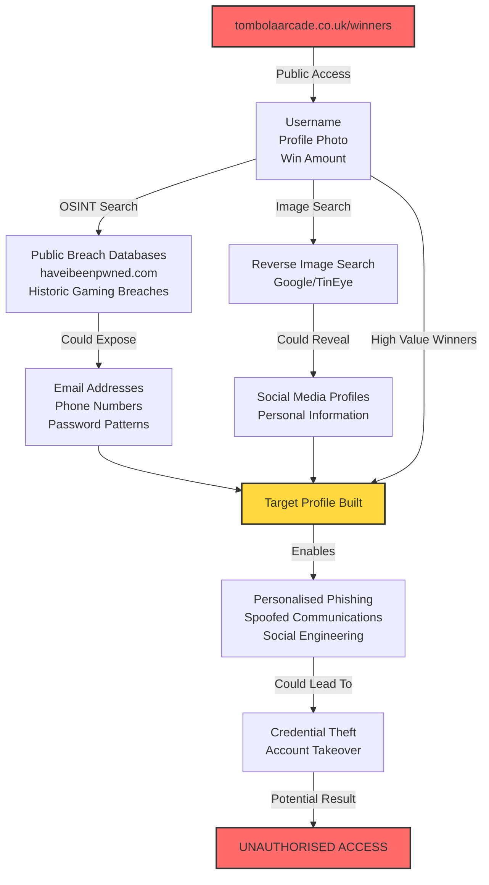

# Technical Analysis: Security Vulnerability Assessment

## The Vulnerability

**Currently exposed on tombolaarcade.co.uk/winners:**
- Usernames published weekly
- Profile photos displayed
- Win amounts visible
- Historical data accessible

This publicly available information could enable criminals to identify and research potential targets.

## Potential Attack Chain

## Why Technical Controls Could Be Bypassed

| Control | Status | Potential Bypass Method |
|---------|--------|------------------------|
| MFA | If enabled | Social engineering for codes |
| Fraud Detection | If active | Legitimate credentials used |
| Email Security | If implemented | Attacker uses similar domain |
| Account Monitoring | If present | Normal login patterns |

**Key Issue**: Social engineering can bypass technical controls when victims voluntarily share credentials.

## Risk Assessment

**Attack Requirements:**
- **Motivation**: Financial gain (always present)
- **Capability**: Basic OSINT and social engineering skills
- **Opportunity**: Public winner information *(currently provided)*

**Vulnerable Demographics:**
- Elderly users (less technical awareness)
- Recent high-value winners (attractive targets)
- Users with common usernames across platforms

## Industry Best Practices

NCSC and ICO guidance recommends:
- Minimise public exposure of user data
- Implement privacy-by-design principles
- Consider vulnerable user populations
- Regular privacy impact assessments

---

### [→ See Mitigation Recommendations](mitigations.md)